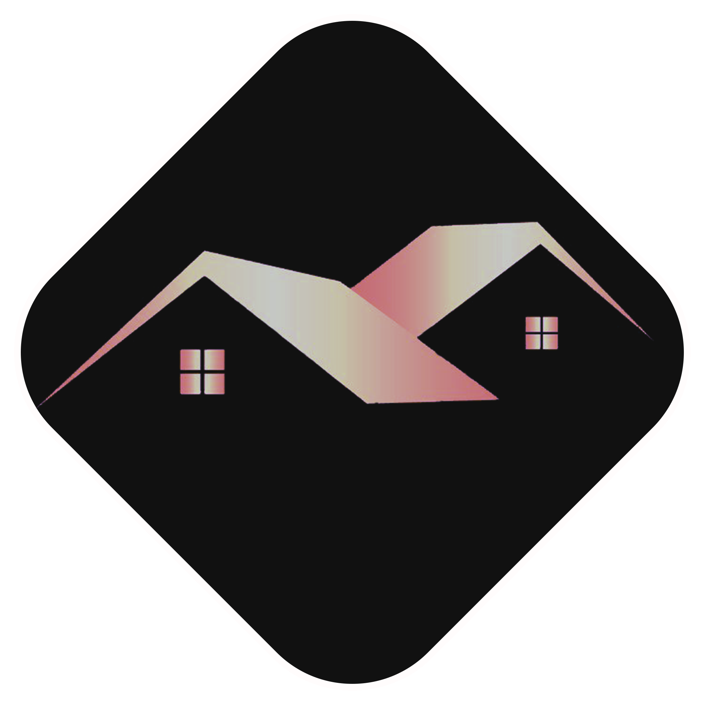
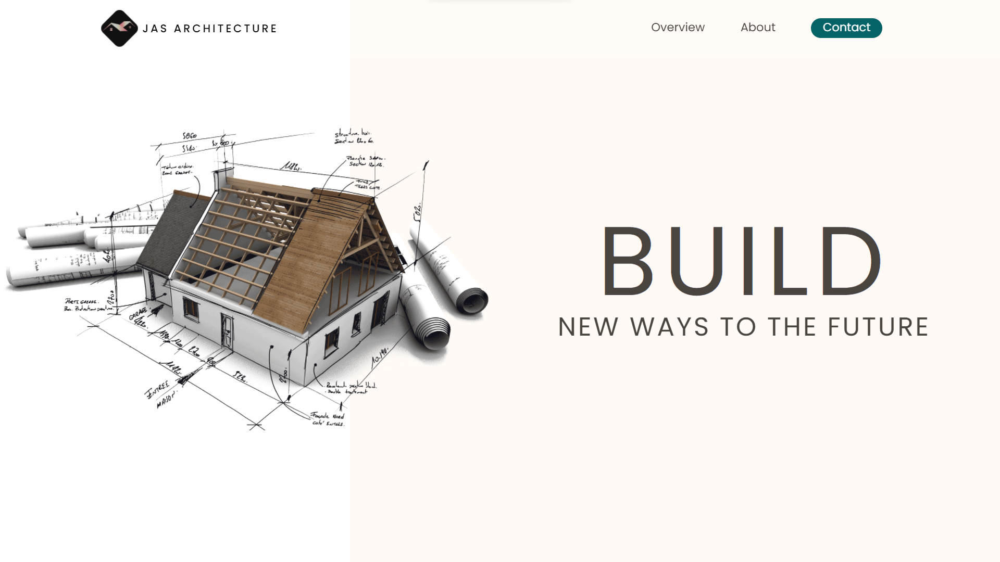

<!-- PROJECT LOGO -->
 

  

<h3 align="center">JAS Architecture</h3>

  

    A Front End Design of a Website - Architecture Based Website
     

  

<!-- TABLE OF CONTENTS -->

  
Table of Contents

  <ol>
    <li>
      <a href="#about-the-project">About The Project</a>
      <ul>
        <li><a href="#built-with">Built With</a></li>
      </ul>
    </li>
    <li>
      <a href="#website">Website</a>
      <ul>
        <a href="https://jas-architecture.netlify.app/">https://jas-architecture.netlify.app/</a>
      </ul>
    </li>
  </ol>

<!-- ABOUT THE PROJECT -->
## About The Project

JAS Architecture was created to highlight the architectural aspect of things in which an architect designed the 3D rendered images on the design page.
 

### Built With

* [Javascript](https://www.javascript.com/)
    * [GSAP](https://greensock.com/gsap/)  
    * [TweenMax](https://greensock.com/tweenmax/)  
    * [TimelineMax](https://greensock.com/timelinemax/)
    * [ScrollMagic](https://scrollmagic.io/)

 

<!-- GETTING STARTED -->
## Website

Link: <a href="https://jas-architecture.netlify.app/" target="_blank">https://jas-architecture.netlify.app/</a>

 

<!-- CONTACT -->
## Contact

Jan Mikko Malizon - [@jnmkkmlzn](https://twitter.com/jnmkkmlzn) - [malizonjanmikko@gmail.com](mailto:malizonjanmikko@gmail.com)

JAS Architecture: [https://github.com/jmmalizon/jas-architecture](https://github.com/jmmalizon/jas-architecture)

(<a href="#top">back to top</a>)

